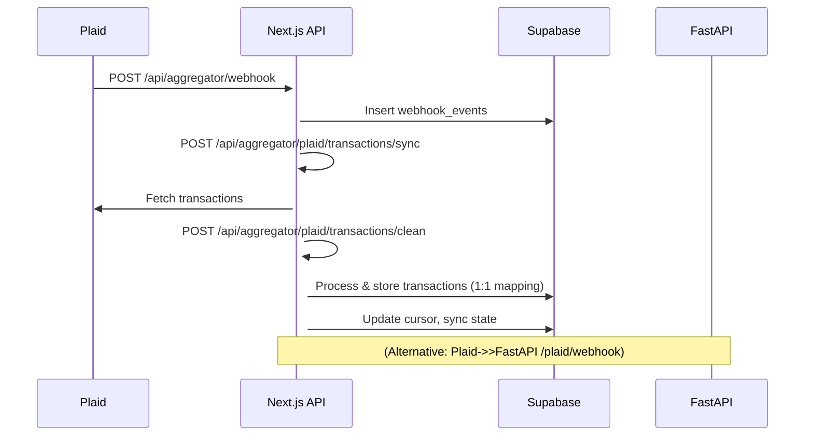

# Plaid API, Webhook, and Transaction Integration Mapping

## Overview

This document provides a comprehensive mapping of all Plaid-related APIs, endpoints, webhook flows, and their interactions with Supabase in the vectr-4 project. It covers both the Next.js (TypeScript) and FastAPI (Python) backends.

---

## 1. Webhook Endpoints

### 1.1 Next.js Webhook Endpoint

- **Path:** `/api/aggregator/webhook` (POST)
- **Purpose:** Receives webhooks from Plaid (and MX, if configured). Handles verification, event storage, and triggers transaction syncs.
- **Signature Verification:**
  - Uses `PLAID_WEBHOOK_SECRET` for HMAC SHA256 signature check (skipped in dev if unset).
- **Payload Example:**

```json
{
	"webhook_type": "TRANSACTIONS",
	"webhook_code": "DEFAULT_UPDATE",
	"item_id": "plaid-item-id",
	...
}
```

- **Supabase Interaction:**
  - Inserts a record into `webhook_events` for audit/idempotency.
  - Looks up `account_links` by `item_id` to get `access_token_encrypted`, `user_id`, and `cursor`.
- **Sync Trigger:**
  - Calls `/api/aggregator/plaid/transactions/sync` (internal Next.js API) with:
    - `access_token`, `cursor`, `count`, and user headers.
  - Handles all Plaid webhook codes: `INITIAL_UPDATE`, `HISTORICAL_UPDATE`, `DEFAULT_UPDATE`, `TRANSACTIONS_REMOVED`, `SYNC_UPDATES_AVAILABLE`.

### 1.2 FastAPI Webhook Endpoint

- **Path:** `/plaid/webhook` (POST)
- **Purpose:** Receives Plaid webhooks for real-time transaction updates (if Plaid is pointed to FastAPI backend).
- **Payload:** Same as above.
- **Supabase Interaction:**
  - Inserts into `webhook_events`.
  - Handles transaction and item webhooks, updating `transactions` and `account_links` tables as needed.

---

## 2. Transaction Sync Endpoints

### 2.1 Next.js Transaction Sync

- **Path:** `/api/aggregator/plaid/transactions/sync` (POST)
- **Purpose:** Fetches new/updated transactions from Plaid for a user, using the access token and cursor. **Now uses the clean processor** for all transaction processing.
- **Request Body:**

```json
{
  "access_token": "...",
  "cursor": "...", // optional
  "count": 100,
  "user_id": "..." // required if not using internal service headers
}
```

- **Headers (internal call):**
  - `Authorization: Bearer <SUPABASE_SERVICE_ROLE_KEY>`
  - `X-User-ID: <user_id>`
- **Supabase Interaction:**
  - Fetches transactions from Plaid API.
  - Calls `/api/aggregator/plaid/transactions/clean` internally to process new and modified transactions with 1:1 mapping.
  - Directly handles removed transactions by marking them as deleted.
  - Updates cursor and sync state in `account_links`.
- **Response:**

```json
{
	"added": [...],
	"modified": [...],
	"removed": [...],
	"has_more": false,
	"next_cursor": "..."
}
```

### 2.2 FastAPI Transaction Sync

- **Path:** `/plaid/transactions/sync` (POST)
- **Purpose:** Manually syncs transactions for a user from Plaid.
- **Request Body:**

```json
{
  "user_id": "...",
  "account_id": "...", // optional
  "start_date": "YYYY-MM-DD", // optional
  "end_date": "YYYY-MM-DD" // optional
}
```

- **Supabase Interaction:**
  - Reads/writes to `transactions`, `account_links`, and related tables.
  - Uses a unified transaction processor for Plaid data.
- **Response:**

```json
{
  "success": true,
  "transactions_processed": 10,
  "transactions_added": 8,
  "transactions_updated": 2,
  "errors": [],
  "message": "Processed 10 transactions (8 new, 2 updated)"
}
```

### 2.3 Next.js Clean Plaid Transaction Processing

- **Path:** `/api/aggregator/plaid/transactions/clean` (POST, GET)
- **Purpose:**
  - **POST:** Processes an array of Plaid transactions with a clean 1:1 mapping to the database schema. **Now used internally by the sync endpoint** for all new and modified transactions.
  - **GET:** Health check for the clean processor, returns processor status and features.
- **Authentication:**
  - **Cookie-based:** For direct user calls (frontend).
  - **Internal service calls:** Uses `internal_user_id` in the request body to bypass Next.js header stripping issues.
- **POST Request Body:**

```json
{
  "transactions": [
    {
      "transaction_id": "string",
      "account_id": "string",
      "amount": 123.45,
      "date": "YYYY-MM-DD",
      ... // All Plaid transaction fields
    }
  ],
  "internal_user_id": "user-uuid" // Optional: for internal service calls only
}
```

- **POST Response:**

```json
{
  "success": true,
  "message": "Processed 10 transactions successfully",
  "results": {
    "processed": 10,
    "errors": 0,
    "new_merchants": 2,
    "matched_merchants": 8,
    "categories_mapped": 10
  }
}
```

- **Supabase Interaction:**
  - Uses a `CleanPlaidTransactionProcessor` to map and save each transaction to the database (transactions, merchants, and categories tables).
  - Handles both direct user authentication and internal service authentication via request body.
- **Note:** Due to Next.js security restrictions that strip certain headers, internal service calls now pass the user ID in the request body instead of headers.
- **GET Response:**

```json
{
  "status": "healthy",
  "processor": "clean-plaid-transaction-processor",
  "version": "1.0.0",
  "description": "Clean 1:1 mapping from Plaid transactions to database schema",
  "features": [
    "VERY_HIGH confidence merchant regex matching",
    "LOW confidence combined description parsing",
    "Automatic merchant creation with Plaid data",
    "Direct category mapping from Plaid detailed categories",
    "Preserves CSV processing compatibility"
  ]
}
```

---

## 3. Account Link Endpoints

### 3.1 FastAPI Account Link

- **Path:** `/plaid/accounts/link` (POST)
- **Purpose:** Links Plaid accounts to a user after successful Plaid Link flow.
- **Request Body:**

```json
{
	"user_id": "...",
	"item_id": "...",
	"access_token": "...",
	"institution_id": "...",
	"accounts": [ ...Plaid account objects... ]
}
```

- **Supabase Interaction:**
  - Inserts into `account_links` and `accounts` tables.

### 3.2 FastAPI Account Management

- **GET /plaid/accounts**: List all Plaid accounts for a user.
- **DELETE /plaid/accounts/{account_link_id}**: Unlink a Plaid account and mark as inactive.

---

## 4. Webhook and Sync Flow

1. **Plaid sends webhook** to `/api/aggregator/webhook` (Next.js) or `/plaid/webhook` (FastAPI).
2. **Webhook endpoint verifies** signature (if Plaid, and secret is set).
3. **Event is logged** in `webhook_events` (Supabase).
4. **For transaction webhooks:** - Next.js: Triggers `/api/aggregator/plaid/transactions/sync` with correct user and access token. - FastAPI: Handles in-process or triggers background sync (TODO in code).
5. **Sync endpoint fetches transactions** from Plaid, processes via clean processor, and stores in `transactions` table.
6. **Account and sync state** (e.g., cursor) are updated in `account_links`.

---

## 5. Supabase Tables Involved

- **webhook_events**: Stores all incoming webhook payloads for audit/idempotency.
- **account_links**: Maps users to Plaid items, stores access tokens, cursors, and sync state.
- **accounts**: Stores individual account details per user/item.
- **transactions**: Stores all transaction data, including Plaid transaction IDs and metadata.

---

## 6. Example Payloads

### 6.1 Plaid Webhook (TRANSACTIONS/DEFAULT_UPDATE)

```json
{
	"webhook_type": "TRANSACTIONS",
	"webhook_code": "DEFAULT_UPDATE",
	"item_id": "plaid-item-id",
	"new_transactions": 2,
	"removed_transactions": [],
	...
}
```

### 6.2 Transaction Sync Request (Next.js)

```json
{
  "access_token": "plaid-access-token",
  "cursor": "optional-cursor",
  "count": 100,
  "user_id": "user-uuid"
}
```

### 6.3 Account Link Request (FastAPI)

```json
{
	"user_id": "user-uuid",
	"item_id": "plaid-item-id",
	"access_token": "plaid-access-token",
	"institution_id": "ins_123",
	"accounts": [
		{
			"account_id": "acc_456",
			"balances": { "current": 1000 },
			"name": "Plaid Checking",
			"type": "depository",
			...
		}
	]
}
```

---

## 7. Notes & Best Practices

- Always keep your `PLAID_WEBHOOK_SECRET` secure and set in production.
- Use the internal service role key and user ID header for secure internal sync calls.
- All webhook and sync events are logged in Supabase for traceability.
- The FastAPI backend can be used for direct Plaid webhook handling if ngrok exposes port 8000.
- The Next.js API is the default webhook receiver if ngrok exposes port 3000.
- **The sync endpoint now uses the clean processor** for all transaction processing, ensuring 1:1 mapping from Plaid data to your database.

---

## 8. Integration Diagram


